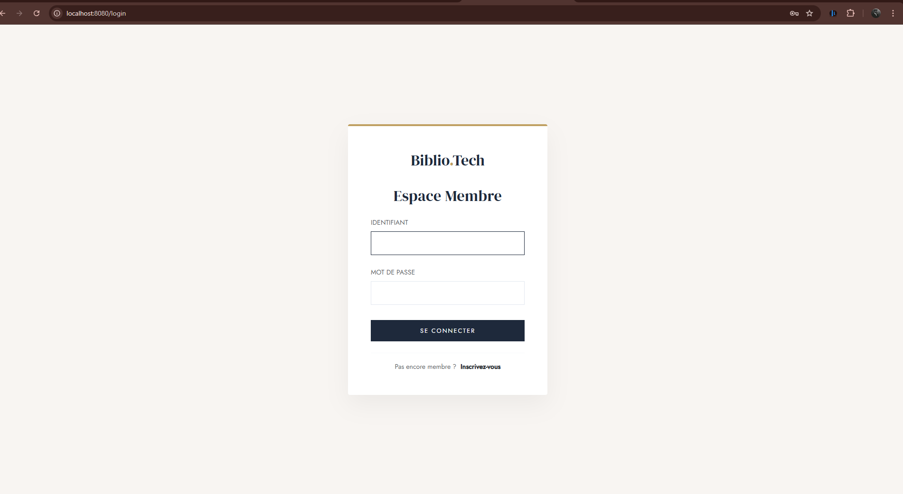
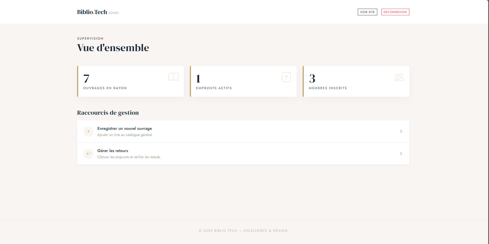
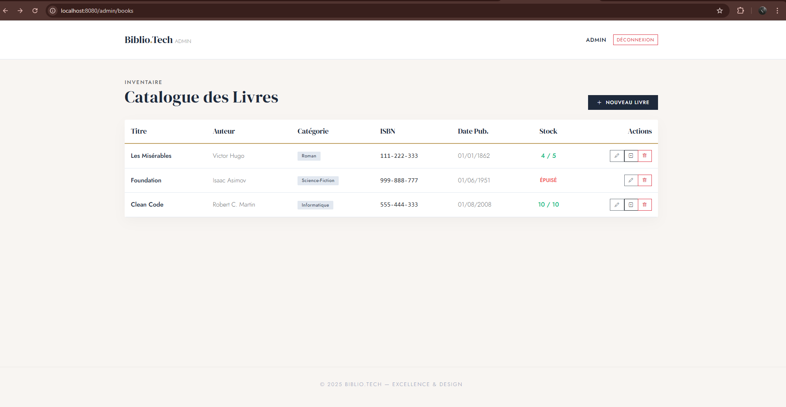
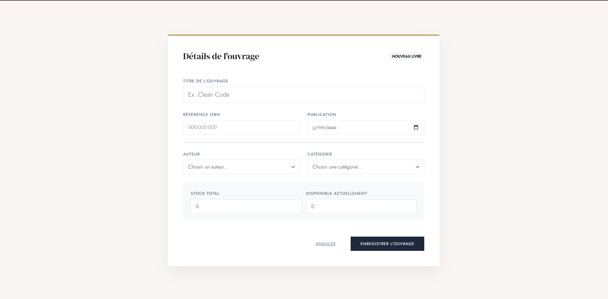

# 📚 Biblio-Tech

> **L'Excellence Opérationnelle au service des Bibliothèques.**
> Un système de gestion (LMS) robuste, sécurisé et modulaire, conçu pour démontrer la puissance de l'architecture Java Enterprise moderne.


---

## 🎬 Galerie & Démo

|                           Page de Connexion                           |                                Dashboard Admin                                 |                             Catalogue Livres                             |
|:---------------------------------------------------------------------:|:------------------------------------------------------------------------------:|:------------------------------------------------------------------------:|
|        |  |        |
|                           *Accès sécurisé*                            |                             *Gestion centralisée*                              |                            *Recherche fluide*                            |
|                         **Gestion des Prêts**                         |                             **Profil Utilisateur**                             |                            **Ajout de Livre**                            |
|  |              |  |
|                      *Transactionnel (à venir)*                       |                        *Historique personnel(à venir)*                         |                            *Edition Atomique*                            |

> *Note : Une vidéo complète du parcours utilisateur est disponible [ici](docs/demo.mp4).*

---

## 🚀 Quick Start

Déployez l'application en **une seule commande** (après configuration de la BDD).

### Prérequis
*   **Java 21** installé.
*   **MySQL 8.0** tournant sur le port `3306`.
*   Base de données créée : `CREATE DATABASE biblio_db;`.

### Lancement
```bash
# Clonez, compilez et lancez
git clone https://github.com/votre-username/biblio-tech.git
cd biblio-tech
./mvnw spring-boot:run
```
> **Accès :** Ouvrez `http://localhost:8080` dans votre navigateur.

---

## ✨ Features (Fonctionnalités Clés)

*   **🔐 Sécurité Robuste :** Authentification via Spring Security (Session-based) avec rôles distincts (ADMIN vs USER).
*   **📚 Gestion de Catalogue :** CRUD complet pour les livres, auteurs et catégories.
*   **🔄 Moteur d'Emprunt :** Système transactionnel de gestion des prêts avec validation des règles métier (quota, disponibilité).
*   **👥 Espace Utilisateur :** Dashboard personnel pour consulter l'historique et les emprunts actifs.
*   **🏗 Architecture Clean :** Séparation stricte des couches (Controller, Service, Repository, Model, DTO).

---

## 🗺 Roadmap

- [x] **Phase 1 : Core Monolith** (MVP fonctionnel)
- [ ] **Phase 2 : Dockerisation Complète** (Résolution du conflit MySQL/Postgres actuel)
- [ ] **Phase 3 : API REST** (Exposition pour clients mobiles/SPA)
- [ ] **Phase 4 : Tests E2E** (Playwright ou Selenium)
- [ ] **Phase 5 : CI/CD** (GitHub Actions)

---

## 🛠 Stack Technique & Architecture

Ce projet respecte les standards de l'industrie pour une application Java monolithique :

| Couche | Technologie     | Rôle |
| :--- |:----------------| :--- |
| **Core** | Spring Boot 4   | Inversion de Contrôle, AOP, Config |
| **Data** | Spring Data JPA | Abstraction Hibernate, Repository Pattern |
| **Web** | Spring MVC      | Gestion des requêtes HTTP |
| **View** | Thymeleaf       | Rendu serveur (SSR) performant |
| **Auth** | Spring Security | Protection contre CSRF, XSS, Fixation de session |

### Structure des Dossiers
L'architecture reflète la séparation des responsabilités :
```
src/main/java/com/charlyken/bibliotech
├── config/       # ⚙️ Configuration (Security, Beans)
├── controller/   # 🎮 Points d'entrée (Web)
├── service/      # 🧠 Logique métier (Transactionnel)
├── model/        # 📦 Entités persistantes (Database)
├── dto/          # 📨 Objets de transfert (Decoupling)
└── repository/   # 💾 Accès aux données (JPA)
```

---

## 🤝 Contribuer

Les contributions sont bienvenues ! Veuillez consulter le fichier `CONTRIBUTING.md` (à venir) pour les directives.

1.  Forkez le projet
2.  Créez votre branche (`git checkout -b feature/AmazingFeature`)
3.  Commitez vos changements (`git commit -m 'Add some AmazingFeature'`)
4.  Poussez vers la branche (`git push origin feature/AmazingFeature`)
5.  Ouvrez une Pull Request

---

## 📄 Licence

Distribué sous la licence MIT. Voir `LICENSE` pour plus d'informations.

---

> **Note aux Reviewers :** Ce projet contient une dette technique identifiée dans `docker-compose.yml` (conflit de driver BDD) qui sera résolue dans la prochaine release.